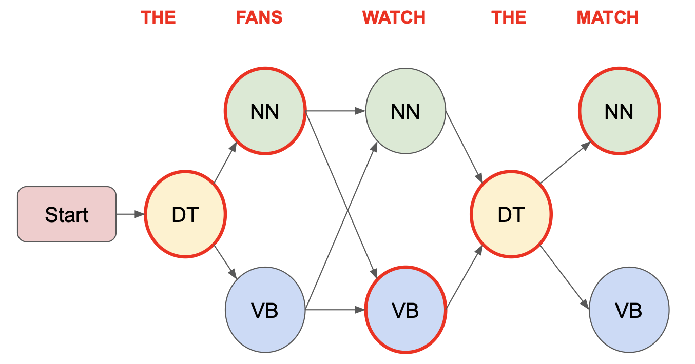

# HMM-Based Part-of-Speech Tagging

## Overview

This repository contains the implementation and data for the assignment focused on applying Hidden Markov Models (HMM) to part-of-speech (POS) tagging. The project utilizes the Wall Street Journal section of the Penn Treebank dataset.

## Data
The data folder includes three files:
- train: Sentences with human-annotated POS tags.
- dev: Sentences with human-annotated POS tags, used for model development.
- test: Raw sentences for POS tag prediction.

## Data Format
Each line in the train and dev files contains three items separated by a tab (\t):
1. Index of the word in the sentence.
2. Word type.
3. Corresponding POS tag.

The test file contains only the first two items (index and word type) as it is used for prediction. Each sentence is followed by a blank line.

## Example
{: width="400px"}

## Tasks

### 1. Vocabulary Creation

##### Overview
Task 1 involved generating a vocabulary from the training data, with a focus on handling unknown words. Words with occurrences below a chosen threshold were replaced with the special token `<unk>`.

##### Threshold Selection and Results
- **Threshold for Unknown Words:** Set at 1, as it offered the best performance improvement.
- **Vocabulary Size:** The final vocabulary consists of 23,183 unique words.
- **Occurrences of `<unk>`:** The `<unk>` token appears 20,011 times, representing rare words.

##### Implementation Notes
The vocabulary was built exclusively from the training data. Words in the development set not found in the vocabulary were also replaced with `<unk>`. The resulting `vocab.txt` lists each word, its vocabulary index, and occurrences, with the lines sorted by descending frequency.

### 2: Model Learning

##### Overview
Task 2 focuses on learning a Hidden Markov Model (HMM) using the training data. The goal is to develop a model that captures the transition and emission probabilities inherent in the dataset.

##### Model Learning and Output
- **Process:** The HMM was trained using the `train` dataset.
- **Output:** The learned model is saved in a JSON file, `hmm.json`, comprising two main dictionaries:
  - `transition`: Contains (state, next state) pairs as keys and transition probabilities t(next state|state) as values.
  - `emission`: Contains (state, observation) pairs as keys and emission probabilities e(observation|state) as values.

##### Model Parameters
- **Transition Parameters:** The `transition` dictionary contains 1,351 parameters.
- **Emission Parameters:** The `emission` dictionary comprises 30,303 parameters.

##### Implementation Notes
The model was strictly trained using the `train` data, with parameters calculated to reflect the transitions and emissions observed in the training set. This approach ensures a robust model that accurately represents the language structure in the training data.

### 3: Greedy Decoding with HMM

##### Overview
Task 3 involves implementing the greedy decoding algorithm using the learned Hidden Markov Model (HMM) and evaluating its performance on the development data.

##### Implementation
- **Greedy Decoding:** The algorithm selects the most probable Part-of-Speech (POS) tag at each step, using this tag to influence the next state's selection.
- **Complexity:** The time complexity is O(s*p), where `s` is the length of a sentence and `p` is the total number of POS tags.
- **Smoothing Applied:** To handle unknown keys in emission and transition dictionaries, smoothing techniques were employed to avoid zero probability issues.

##### Evaluation
- **Accuracy on Development Data:** Achieved an accuracy of 93.57% on the `dev` dataset.
- **Output for Test Data:** POS tag predictions for the `test` dataset are outputted in `greedy.out`, formatted similarly to the training data.

##### Implementation Notes
The greedy decoding algorithm's implementation focused on efficiency and handling of unknown scenarios through smoothing. This approach ensures robust predictions even in the face of unseen data or rare events in the HMM.

### 4: Viterbi Decoding with HMM

##### Overview
Task 4 involves the implementation of the Viterbi decoding algorithm within the context of a Hidden Markov Model (HMM) and evaluating its performance on the development data.

##### Implementation
- **Viterbi Algorithm:** This approach considers all possible Part-of-Speech (POS) tags at each stage, determining the most probable tag based on the maximum probability calculated from all previous states.
- **Complexity:** The time complexity of the Viterbi algorithm is O(s*p*p), where `s` is the sentence length and `p` is the total number of POS tags.
- **Smoothing Technique:** To avoid zero probabilities for unknown keys in the emission and transition dictionaries, smoothing techniques were applied.

##### Evaluation
- **Accuracy on Development Data:** The Viterbi decoding achieved an accuracy of 93.02% on the `dev` dataset.
- **Output for Test Data:** POS tag predictions for the `test` dataset are outputted in `viterbi.out`, maintaining the format of the training data.

##### Implementation Notes
The Viterbi decoding algorithm's implementation emphasized comprehensive consideration of all possible tag sequences and handling rare events or unseen data through smoothing. This approach enhances the accuracy and reliability of the POS tagging.
